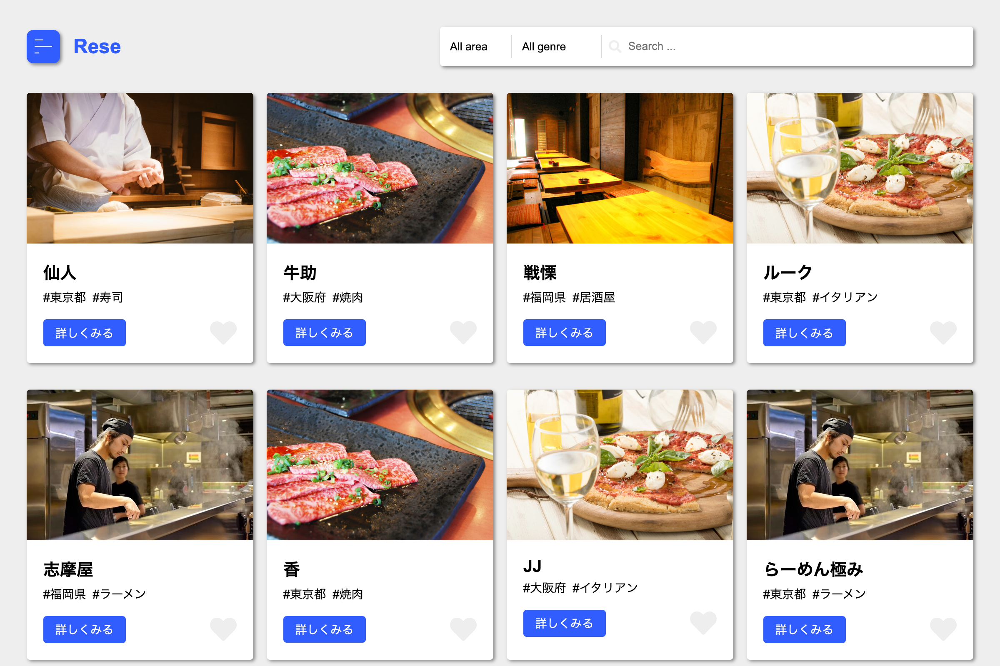

# Rese

「Rese」は Web ベースの飲食店予約サービスです。



## 作成した目的

プログラミングスクールの課題のために開発しました。

## アプリケーションURL

https://web-no-benkyo.com

### 動作確認用アカウント

| 種類 | メールアドレス | パスワード |
|---|---|---|
| 利用者 | user@example.com | password |
| 店舗代表者 | owner@example.com | password |
| 管理者 | admin@example.com | password |

## 他のリポジトリ

- フロントエンド: https://github.com/ryamao/rese-frontend
- バックエンド: https://github.com/ryamao/rese-backend
- インフラ(AWS): https://github.com/ryamao/rese-cdk

## 機能一覧

- 顧客向け機能
  - 認証機能
  - 飲食店情報の検索と閲覧
  - 飲食店予約登録
  - 飲食店お気に入り登録
  - 飲食店評価登録
  - メールでの予約リマインド
  - 入店確認用QRコード発行
  - Stripe決済
- 店舗代表者向け機能
  - 飲食店情報の作成と変更
  - 店舗別予約一覧
  - QRコードでの入店確認
  - 請求金額登録
- 管理者向け機能
  - 店舗代表者アカウント作成
  - お知らせメール送信

## 使用技術(実行環境)

- PHP 8.2
- Laravel 10.x
- MySQL 8.0
- React 18.x

## テーブル設計

### users テーブル

| カラム名 | 型 | PRIMARY KEY | UNIQUE KEY | NOT NULL | FOREIGN KEY |
|---|---|---|---|---|---|
| id | unsigned bigint | ○ | ○ | ○ |  |
| name | varchar(100) |  |  | ○ |
| email | varchar(100) |  |  | ○ |
| password | varchar(100) |  |  | ○ |
| email_verified_at | timestamp |  |  |  |
| remember_token | varchar(100) |  |  |  |
| created_at | timestamp |  |  |  |
| updated_at | timestamp |  |  |  |
| stripe_id | varchar(255) |  |  |  |
| pm_type | varchar(255) |  |  |  |
| pm_last_four | varchar(255) |  |  |  |
| trial_ends_at | timestamp |  |  |  |

### shops テーブル

| カラム名 | 型 | PRIMARY KEY | UNIQUE KEY | NOT NULL | FOREIGN KEY |
|---|---|---|---|---|---|
| id | unsigned bigint | ○ | ○ | ○ |  |
| owner_id | unsigned bigint |  |  | ○ | users(id) |
| area_id | unsigned bigint |  |  | ○ | areas(id) |
| genre_id | unsigned bigint |  |  | ○ | genres(id) |
| name | varchar(100) |  |  | ○ |  |
| image_url | varchar(2048) |  |  | ○ |  |
| detail | text |  |  | ○ |  |
| created_at | timestamp |  |  |  |
| updated_at | timestamp |  |  |  |

### areas テーブル

| カラム名 | 型 | PRIMARY KEY | UNIQUE KEY | NOT NULL | FOREIGN KEY |
|---|---|---|---|---|---|
| id | unsigned bigint | ○ | ○ | ○ |  |
| name | varchar(100) |  |  | ○ |  |
| created_at | timestamp |  |  |  |
| updated_at | timestamp |  |  |  |

### genres テーブル

| カラム名 | 型 | PRIMARY KEY | UNIQUE KEY | NOT NULL | FOREIGN KEY |
|---|---|---|---|---|---|
| id | unsigned bigint | ○ | ○ | ○ |  |
| name | varchar(100) |  |  | ○ |  |
| created_at | timestamp |  |  |  |
| updated_at | timestamp |  |  |  |

### favorites テーブル

| カラム名 | 型 | PRIMARY KEY | UNIQUE KEY | NOT NULL | FOREIGN KEY |
|---|---|---|---|---|---|
| id | unsigned bigint | ○ | ○ | ○ |  |
| user_id | unsigned bigint |  |  | ○ | users(id) |
| shop_id | unsigned bigint |  |  | ○ | shops(id) |
| created_at | timestamp |  |  |  |
| updated_at | timestamp |  |  |  |

### reservations テーブル

| カラム名 | 型 | PRIMARY KEY | UNIQUE KEY | NOT NULL | FOREIGN KEY |
|---|---|---|---|---|---|
| id | unsigned bigint | ○ | ○ | ○ |  |
| user_id | unsigned bigint |  |  | ○ | users(id) |
| shop_id | unsigned bigint |  |  | ○ | shops(id) |
| reserved_at | datetime |  |  | ○ |  |
| number_of_guests | unsigned int |  |  | ○ |  |
| is_checked_in | tiny int |  |  | ○ |  |
| created_at | timestamp |  |  |  |
| updated_at | timestamp |  |  |  |

### billings テーブル

| カラム名 | 型 | PRIMARY KEY | UNIQUE KEY | NOT NULL | FOREIGN KEY |
|---|---|---|---|---|---|
| id | unsigned bigint | ○ | ○ | ○ |  |
| reservation_id | unsigned bigint |  |  | ○ | reservations(id) |
| amount | int |  |  | ○ |  |
| description | varchar(100) |  |  | ○ |  |
| is_checked_in | tiny int |  |  | ○ |  |
| created_at | timestamp |  |  |  |
| updated_at | timestamp |  |  |  |

### reviews テーブル

| カラム名 | 型 | PRIMARY KEY | UNIQUE KEY | NOT NULL | FOREIGN KEY |
|---|---|---|---|---|---|
| id | unsigned bigint | ○ | ○ | ○ |  |
| user_id | unsigned bigint |  |  | ○ | users(id) |
| shop_id | unsigned bigint |  |  | ○ | shops(id) |
| rating | unsigned tiny int |  |  | ○ |  |
| comment | text |  |  |   |  |
| created_at | timestamp |  |  |  |
| updated_at | timestamp |  |  |  |

### roles テーブル

| カラム名 | 型 | PRIMARY KEY | UNIQUE KEY | NOT NULL | FOREIGN KEY |
|---|---|---|---|---|---|
| id | unsigned bigint | ○ | ○ | ○ |  |
| name | varchar(255) |  |  | ○ |  |
| guard_name | varchar(255) |  |  | ○ |  |
| created_at | timestamp |  |  |  |
| updated_at | timestamp |  |  |  |

### permissions テーブル

| カラム名 | 型 | PRIMARY KEY | UNIQUE KEY | NOT NULL | FOREIGN KEY |
|---|---|---|---|---|---|
| id | unsigned bigint | ○ | ○ | ○ |  |
| name | varchar(255) |  |  | ○ |  |
| guard_name | varchar(255) |  |  | ○ |  |
| created_at | timestamp |  |  |  |
| updated_at | timestamp |  |  |  |

### role_has_permissions テーブル

| カラム名 | 型 | PRIMARY KEY | UNIQUE KEY | NOT NULL | FOREIGN KEY |
|---|---|---|---|---|---|
| role_id | unsigned bigint | ○ | ○ | ○ |  |
| permission_id | unsigned bigint | ○ | ○ | ○ |  |

### model_has_roles テーブル

| カラム名 | 型 | PRIMARY KEY | UNIQUE KEY | NOT NULL | FOREIGN KEY |
|---|---|---|---|---|---|
| model_type | varchar(255) | ○ | ○ | ○ |  |
| model_id | unsigned bigint | ○ | ○ | ○ |  |
| role_id | unsigned bigint | ○ | ○ | ○ |  |

### model_has_permissions テーブル

| カラム名 | 型 | PRIMARY KEY | UNIQUE KEY | NOT NULL | FOREIGN KEY |
|---|---|---|---|---|---|
| model_type | varchar(255) | ○ | ○ | ○ |  |
| model_id | unsigned bigint | ○ | ○ | ○ |  |
| permission_id | unsigned bigint | ○ | ○ | ○ |  |

### subscriptions テーブル

| カラム名 | 型 | PRIMARY KEY | UNIQUE KEY | NOT NULL | FOREIGN KEY |
|---|---|---|---|---|---|
| id | unsigned bigint | ○ | ○ | ○ |  |
| user_id | unsigned bigint |  |  | ○ | users(id) |
| name | varchar(255) |  |  | ○ |  |
| stripe_id | varchar(255) |  |  | ○ |  |
| stripe_status | varchar(255) |  |  | ○ |  |
| stripe_price | varchar(255) |  |  |  |  |
| quantity | int |  |  |  |  |
| trial_ends_at | timestamp |  |  |  |  |
| ends_at | timestamp |  |  |  |  |
| created_at | timestamp |  |  |  |
| updated_at | timestamp |  |  |  |

### subscription_items テーブル

| カラム名 | 型 | PRIMARY KEY | UNIQUE KEY | NOT NULL | FOREIGN KEY |
|---|---|---|---|---|---|
| id | unsigned bigint | ○ | ○ | ○ |  |
| subscription_id | unsigned bigint |  |  | ○ | users(id) |
| stripe_id | varchar(255) |  |  | ○ |  |
| stripe_status | varchar(255) |  |  | ○ |  |
| stripe_price | varchar(255) |  |  |  |  |
| quantity | int |  |  |  |  |
| created_at | timestamp |  |  |  |
| updated_at | timestamp |  |  |  |

### failed_jobs テーブル

| カラム名 | 型 | PRIMARY KEY | UNIQUE KEY | NOT NULL | FOREIGN KEY |
|---|---|---|---|---|---|
| id | unsigned bigint | ○ | ○ | ○ |  |
| uuid | varchar(255) |  |  | ○ |  |
| connection | text |  |  | ○ |  |
| queue | text |  |  | ○ |  |
| payload | longtext |  |  | ○ |  |
| exception | longtext |  |  |  |  |
| failed_at | timestamp |  |  |  |  |

### personal_access_tokens テーブル

| カラム名 | 型 | PRIMARY KEY | UNIQUE KEY | NOT NULL | FOREIGN KEY |
|---|---|---|---|---|---|
| id | unsigned bigint | ○ | ○ | ○ |  |
| tokenable_type | varchar(255) |  |  | ○ |  |
| tokenable_id | unsigned bigint |  |  | ○ |  |
| name | varchar(255) |  |  | ○ |  |
| token | varchar(64) |  |  | ○ |  |
| abilities | text |  |  |  |  |
| last_used_at | timestamp |  |  |  |
| expires_at | timestamp |  |  |  |
| created_at | timestamp |  |  |  |
| updated_at | timestamp |  |  |  |

### password_reset_tokens テーブル

| カラム名 | 型 | PRIMARY KEY | UNIQUE KEY | NOT NULL | FOREIGN KEY |
|---|---|---|---|---|---|
| email | varchar(255) | ○ | ○ | ○ |  |
| token | varchar(255) |  |  | ○ |  |
| created_at | timestamp |  |  |  |

### sessions テーブル

| カラム名 | 型 | PRIMARY KEY | UNIQUE KEY | NOT NULL | FOREIGN KEY |
|---|---|---|---|---|---|
| id | unsigned bigint | ○ | ○ | ○ |  |
| user_id | unsigned bigint |  |  | ○ | users(id) |
| ip_address | varchar(45) |  |  |  |  |
| user_agent | text |  |  |  |  |
| payload | longtext |  |  | ○ |  |
| last_activity | int |  |  | ○ |  |

## ER図


## 環境構築

ローカル環境の構築手順を説明します。
ローカルで実行するためには Docker をインストールする必要があります。

1. プロジェクトのリポジトリをクローンしてください。

```shell-session
git clone --recursive https://github.com/ryamao/rese-local.git
```

2. バックエンドの環境設定ファイルを作成してください。

```shell-session
cp .env.backend.example .env.backend
```

環境設定ファイルの以下の項目に値を設定してください。

| 変数名 | 説明 |
|---|---|
| STRIPE_KEY | Stripeの公開可能キー |
| STRIPE_SECRET | Stripeのシークレットキー |
| STRIPE_WEBHOOK_SECRET | Stripe Webhookのシークレットキー |

3. フロントエンドの環境設定ファイルを作成してください。

```shell-session
cp .env.frontend.example .env.frontend
```

| 変数名 | 説明 |
|---|---|
| STRIPE_PUBLIC_KEY | Stripeの公開可能キー |

4. Docker コンテナを起動してください。

```shell-session
docker compose build
docker compose up -d
```

5. ブラウザから http://localhost にアクセスしてアプリを実行してください。

初期状態では以下のユーザーが使用可能です。

| 種類 | メールアドレス | パスワード |
|---|---|---|
| 利用者 | user@example.com | password |
| 店舗代表者 | owner@example.com | password |
| 管理者 | admin@example.com | password |
